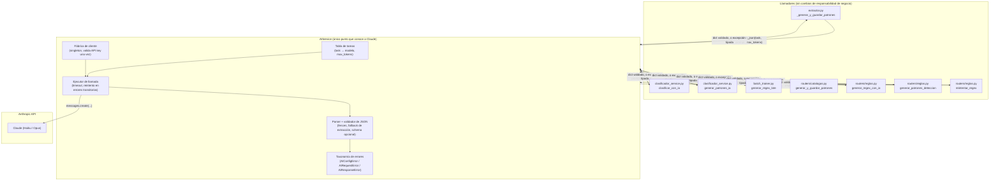

# Arquitectura `AIService` — Consolidación del flujo de IA (Claude)

**Alcance:** exclusivamente el flujo de integración con Claude. No incluye nuevas funcionalidades, no toca el modelo de datos, no toca ningún otro subsistema.
**Estado del proyecto:** post Sprint 1 (limpieza de código muerto, higiene, wiring parcial de configuración de modelos, restricción de unicidad en `reglas_extraccion`).
**Este documento es de diseño únicamente. No se implementó ningún cambio de código.**

---

## 1. Inventario completo del flujo de IA actual

Se re-escaneó el código después del Sprint 1 (algunos archivos cambiaron: `api/parsers/ai_fallback.py` ya no existe — fue eliminado como código muerto). El inventario vigente es de **7 puntos de llamada a Claude**, repartidos en 5 archivos:

| # | Archivo / función | Propósito de negocio | Cliente Anthropic | Modelo usado | Parseo de JSON | Validación de respuesta | Reintentos | Manejo de error |
|---|---|---|---|---|---|---|---|---|
| 1 | `services/extractor.py::_generar_y_guardar_patrones` | Generar patrones de detección (compañía/ramo/subramo) durante la extracción automática | `ai_utils.make_anthropic_client()` | `config.MODEL_EXTRACTOR` | `ai_utils.parse_claude_json()` | Valida cada regex con `re.compile` | Ninguno | `try/except` amplio → retorna `{}` silenciosamente |
| 2 | `services/clasificador_service.py::clasificar_con_ia` | Clasificar compañía/ramo/subramo de un PDF entrante | `ai_utils.make_anthropic_client()` | `config.MODEL_CLASIFICADOR` | `ai_utils.parse_claude_json()` | Ninguna (confía en la forma del JSON) | Ninguno | Propaga la excepción; el caller (`procesar_pdf`) la captura y marca `estado="error"` |
| 3 | `services/clasificador_service.py::generar_patrones_ia` | Generar patrones de detección tras clasificar con IA | `ai_utils.make_anthropic_client()` | `config.MODEL_CLASIFICADOR` | `ai_utils.parse_claude_json()` | Valida cada regex con `re.compile` | Ninguno | Propaga; el caller lo envuelve en `try/except: pass` |
| 4 | `services/batch_trainer.py::generar_regex_lote` | Generar regex de extracción de campo a partir de N ejemplos de un lote | `anthropic.Anthropic(api_key)` directo (**no usa `ai_utils`**) | `config.MODEL_BATCH_TRAINER` (conectado en Sprint 1) | `json.loads` manual + **fallback propio** (`re.search(r'\{.*\}', ...)`) que `ai_utils` no tiene | Prueba el regex contra todo el lote (`probar_regex_en_lote`) | Ninguno | `raise ValueError` con mensaje propio |
| 5 | `routers/catalogos.py::generar_y_guardar_patrones` | Generar y guardar patrones de detección desde la UI de catálogos | `anthropic.Anthropic(api_key)` directo | `config.MODEL_PATTERN_GEN` (conectado en Sprint 1) | strip manual de fences markdown + `json.loads` | Valida cada regex con `re.compile` | Ninguno | `raise HTTPException(500, ...)` |
| 6 | `routers/reglas.py::generar_regex_con_ia` | Generar regex de extracción para un campo, desde una sola muestra (UI de reglas) | `anthropic.Anthropic(api_key)` directo | Hardcodeado `"claude-haiku-4-5-20251001"` (deliberadamente **no** conectado a `MODEL_REGEX_IA` en Sprint 1 — su default es `"claude-opus-4-7"`, distinto) | strip manual + `json.loads` | Valida 1 regex con `re.compile` + prueba contra texto completo | Ninguno | `raise HTTPException(422/500, ...)` |
| 7 | `routers/reglas.py::generar_patrones_deteccion` | Generar patrones de detección desde la UI de reglas | `anthropic.Anthropic(api_key)` directo | `config.MODEL_PATTERN_GEN` (conectado en Sprint 1) | strip manual + `json.loads` | Valida cada regex con `re.compile` | Ninguno | `raise HTTPException(400/500, ...)` |
| 8 | `routers/reglas.py::reintentar_regex` | Pedir una variante "más laxa" del regex que falló (flujo manual, no automático) | `anthropic.Anthropic(api_key)` directo | Mismo hardcode que #6, mismo motivo | strip manual + `json.loads` | Valida 1 regex + prueba contra texto completo | Ninguno | `raise HTTPException(422/500, ...)` |

**Hallazgo clave sobre "reintentos":** hoy **no existe ningún mecanismo real de reintento** (backoff, reintento ante 429/5xx/timeout) en ningún punto del sistema. El endpoint `reintentar-regex` (#8) es un flujo *manual* iniciado por el usuario para pedir un regex distinto — no es resiliencia técnica ante fallos de la API de Claude. Si Claude responde con rate-limit o timeout hoy, la llamada simplemente falla y el error se propaga (con 4 contratos distintos según el sitio, ver tabla).

### 1.1 Duplicación confirmada (heredada de la auditoría original, aún vigente tras Sprint 1)
- **3 formas de crear el cliente**: `ai_utils.make_anthropic_client()` (usado en 3 de 8 sitios) vs. `anthropic.Anthropic(api_key=...)` directo (5 de 8 sitios) — cada uno con su propio chequeo de `ANTHROPIC_API_KEY` ausente y su propio mensaje de error.
- **2 formas de parsear el JSON de respuesta**: `ai_utils.parse_claude_json()` (regex de un solo paso para quitar fences) vs. strip manual línea por línea (`if raw.startswith("```"): ...`) repetido con variaciones menores en 4 sitios — y `batch_trainer.py` tiene además un fallback (`re.search(r'\{.*\}', ...)`) que ningún otro sitio tiene, así que si Claude devuelve JSON con texto alrededor, solo ese sitio lo tolera.
- **4 contratos de error distintos**: `{}` silencioso, `raise ValueError`, `except: pass`, `raise HTTPException` (con 3 códigos distintos según el sitio: 400, 422, 500).
- **5 configuraciones de modelo** (`config.py`) para 8 sitios — 2 sitios (#6, #8) usan un modelo hardcodeado que a propósito no se conectó a su variable "semánticamente correcta" en Sprint 1, por una razón real: hacerlo cambiaría el modelo efectivamente usado (haiku→opus), lo cual violaba el mandato de "no cambiar comportamiento" de ese sprint. Esa decisión sigue pendiente y **no debe resolverse silenciosamente** en esta migración tampoco (ver §4, Etapa 3).

---

## 2. Por qué esto es un problema *de crecimiento*, no solo de estilo

El Sprint 1 ya demostró el costo de esta dispersión: conectar 3 variables de configuración que ya existían tocó 3 archivos, y 2 de los 8 sitios no se pudieron tocar sin arriesgar un cambio de comportamiento no autorizado — porque no hay un lugar único donde razonar "qué modelo usa esta tarea y por qué".

A medida que el catálogo de aseguradoras crezca (el objetivo explícito de "preparar para crecer"), el volumen de llamadas a Claude crece con él, y con eso llegan problemas que **hoy no existen en ningún lugar del código**: rate limiting de la API de Anthropic, necesidad de reintentar ante fallos transitorios, necesidad de medir costo/latencia por tarea, necesidad de un modelo de fallback si el primario falla. Implementar cualquiera de esas capacidades hoy significa tocar 8 sitios en 5 archivos, con 4 contratos de error distintos que cada caller interpreta a su manera. Ese es el problema de fondo que `AIService` resuelve: **no es una limpieza más — es la precondición para que resiliencia/observabilidad de IA sea una sola cosa que se construye una vez, no ocho.**

---

## 3. Arquitectura propuesta

### 3.1 Diagrama



Los prompts (el texto de negocio: "eres un experto en pólizas mexicanas...") **siguen viviendo en cada llamador**, no en `AIService`. El servicio no sabe qué es un subramo ni qué es un regex de póliza — solo sabe cómo hablar con Claude de forma confiable. Esta frontera es intencional (ver riesgos, §3.4).

### 3.2 Responsabilidades de `AIService`

**Sí es responsable de:**
1. **Ciclo de vida del cliente Anthropic** — una sola fábrica/singleton, un solo lugar que valida `ANTHROPIC_API_KEY` y lanza un error claro si falta.
2. **Resolución de modelo por tarea** — una tabla interna `task → variable de config → modelo` que reemplaza las 5 constantes `MODEL_*` de `config.py` dispersas y hoy usadas de forma inconsistente. Cada uno de los 8 sitios se identifica con un nombre de tarea explícito (p. ej. `"clasificador"`, `"patrones_deteccion"`, `"regex_campo"`), no con un modelo hardcodeado.
3. **Ejecución de la llamada** — timeout explícito y (en una etapa posterior, ver §4) reintento con backoff ante errores transitorios (429, 5xx, timeout de red) — nunca ante errores de contenido (JSON inválido no se reintenta igual que un rate-limit; son categorías distintas).
4. **Parseo y validación de la respuesta** — una sola función de extracción de JSON (fences markdown + el fallback de `batch_trainer.py` como comportamiento por defecto, no como caso especial de un solo sitio) y un punto de extensión opcional para que el llamador valide la forma esperada (p. ej. "debe tener las claves `compania`/`ramo`/`subramo`") sin reimplementar el parseo.
5. **Taxonomía de errores** — una jerarquía pequeña y estable (config ausente / fallo de red-o-límite tras agotar reintentos / respuesta no parseable o inválida) que cada llamador traduce a su propio contrato (HTTP, `{}`, `ValueError`, lo que corresponda) **sin duplicar el diagnóstico**, solo el mapeo final.

**No es responsable de** (frontera deliberada):
- El contenido de los prompts (redacción, contexto de negocio, ejemplos) — sigue siendo decisión de cada llamador, porque cada uno resuelve un problema de dominio distinto (clasificar vs. generar regex vs. generar patrones).
- Decidir qué hacer con el resultado (guardar en BD, fusionar con datos existentes, marcar un estado) — eso es lógica de negocio de cada servicio/router, no de la infraestructura de IA.
- Elegir *cuál* de los 5 conceptos de modelo corresponde a cada tarea cuando hay ambigüedad de negocio (el caso #6/#8 de este documento) — la tabla de tareas registra la decisión ya tomada, no la toma por sí sola.

### 3.3 Ventajas

- **Reintentos y timeout en un solo lugar** — hoy no existen; agregarlos hoy significaría tocar 8 sitios. Con `AIService`, se agregan una vez y los 8 sitios se benefician sin cambio de código en sí.
- **Punto único de instrumentación** — cuando el volumen de llamadas crezca con el catálogo, medir latencia/costo/tasa de error por tarea se vuelve una sola pieza de código, no ocho.
- **Contrato de error uniforme hacia adentro** — los routers dejan de tener 4 formas distintas de interpretar "Claude falló"; cada uno sigue exponiendo su propio código HTTP hacia afuera (eso no cambia, ver compatibilidad en §5), pero internamente razonan sobre 3 tipos de error, no sobre excepciones genéricas.
- **Elimina la duplicación de mecanismo sin tocar los prompts** — resuelve el hallazgo de la auditoría original ("4 archivos reimplementan el parseo de JSON") sin necesitar decidir todavía cuál de los prompts de negocio es "el correcto" (esa es una decisión de producto distinta, ya señalada como pendiente en `PLAN_REFACTOR.md`).
- **Aísla el proveedor de IA** — si en el futuro se necesita un modelo de respaldo, o cambiar de proveedor para alguna tarea específica, el cambio ocurre en un archivo, no en ocho.
- **Hace visible la inconsistencia de modelos** en vez de esconderla — la tabla de tareas obliga a que cada uno de los 8 sitios declare explícitamente qué modelo usa y por qué, en vez de que ese conocimiento viva implícito en un string repetido.

### 3.4 Riesgos

| Riesgo | Mitigación |
|---|---|
| **"Servicio dios"**: que `AIService` empiece a absorber lógica de negocio (qué prompt usar, cómo interpretar un resultado específico) y termine tan acoplado como hoy, solo que centralizado. | Mantener la frontera de §3.2 estricta: `AIService` ejecuta y valida forma, no decide significado. Si un caller necesita lógica específica, vive en el caller. |
| **Reintentos automáticos son comportamiento nuevo**, no una migración neutra — hoy una llamada falla una vez y ya; con reintentos, una llamada que antes fallaba rápido ahora puede tardar más (varios intentos con backoff) antes de fallar. | Introducir los reintentos en una etapa separada y posterior a la migración de los 8 sitios (§4, Etapa 4), con timeout total explícito, y comunicar el cambio de latencia esperado antes de activarlo — no debe colarse como efecto lateral de "solo estoy moviendo código". |
| **Migración a medias deja dos patrones convivientes** (algunos sitios ya en `AIService`, otros con `anthropic.Anthropic()` directo) — riesgo de que alguien agregue un noveno sitio copiando el patrón viejo durante la ventana de migración. | Etapas pequeñas e independientes (§4), cada una deja el sistema completo y consistente — no se empieza una etapa nueva sin cerrar la anterior con sus pruebas. |
| **Los 2 sitios con mismatch de modelo conocido** (#6 y #8, hardcodeados a haiku pese a que su variable "correcta" apunta a opus) podrían "corregirse" sin querer al forzarlos a pasar por la tabla de tareas de `AIService`. | La tabla de tareas debe registrar explícitamente el modelo **actual** (haiku) para esas dos tareas, con una anotación de que es una discrepancia conocida pendiente de decisión de negocio — igual que se dejó en Sprint 1, solo que ahora visible en un solo lugar en vez de escondida en 2 archivos distintos. |
| **Sin tests automatizados en el repo** — la única red de seguridad de esta migración es verificación manual por endpoint, igual que en Sprint 1. Con 8 sitios en vez de 7 archivos sencillos, el espacio de verificación es mayor. | Migrar de 2-3 sitios por etapa (no los 8 de golpe), con casos de prueba guardados (texto de entrada conocido + respuesta esperada) que se puedan re-ejecutar en cada etapa siguiente para detectar regresiones cruzadas. |
| **Llamadas síncronas dentro de un request HTTP de FastAPI**: si se agrega backoff con reintentos, un endpoint que hoy responde rápido (aunque falle) podría tardar visiblemente más para el usuario del frontend antes de fallar o tener éxito. | Fijar un timeout total (no solo por intento) desde el diseño de la Etapa 4, y medir el peor caso antes de activarlo en producción. |

### 3.5 Interfaz pública propuesta (descripción, no código)

Un único punto de entrada para todos los llamadores, con esta forma conceptual:

- **Entrada:** nombre de tarea (identifica qué modelo/config usar), el prompt ya construido por el llamador (texto completo, en español, con el contexto de negocio que hoy cada sitio ya redacta), y el límite de tokens de la respuesta.
- **Salida:** un diccionario ya parseado y con las fences de markdown removidas — el mismo tipo de resultado que hoy devuelve `parse_claude_json()`, pero con el fallback de extracción de `batch_trainer.py` incluido por defecto para todos, no solo para ese sitio.
- **Fallas:** en vez de que cada llamador reciba una excepción genérica de `json.JSONDecodeError` o de la librería `anthropic`, recibe una de 3 categorías estables (configuración ausente, fallo de comunicación tras reintentos agotados, respuesta no parseable/válida) — y decide él mismo cómo traducir eso a su contrato actual (HTTP 400/422/500, `{}`, `ValueError`, etc., **sin que ese contrato cambie de cara al frontend**).

Validación de forma específica (p. ej. "la respuesta debe tener las claves `compania`, `ramo`, `subramo`") queda como una responsabilidad *opcional* que el llamador puede pedir, no algo que `AIService` impone por defecto — porque los 8 sitios no comparten la misma forma de respuesta esperada, y forzar un esquema único aquí sí sería diseñar de más para un problema que no existe todavía.

---

## 4. Plan de migración por etapas

Cada etapa deja el sistema **completo y funcionando**, sin endpoints rotos, y es independiente de que se ejecute o no la siguiente. Se puede pausar después de cualquier etapa sin dejar el sistema en un estado inconsistente.

### Etapa 0 — Crear `AIService` sin tocar ningún llamador
- Nuevo archivo (p. ej. `api/services/ai_service.py`) con la fábrica de cliente, la tabla de tareas (reflejando **exactamente** los modelos que usa cada uno de los 8 sitios hoy, incluyendo los 2 con mismatch conocido) y el parser/validador de JSON.
- Comportamiento interno idéntico al actual (mismo parseo, mismo fallback de `batch_trainer.py` disponible para todos, pero **sin reintentos todavía** — eso es la Etapa 4).
- **Riesgo:** cero. El archivo nuevo no se importa desde ningún sitio activo; no puede romper nada porque nada lo usa aún.
- **Prueba:** el archivo nuevo se puede probar de forma aislada (llamar a `AIService` directamente con un prompt de prueba) sin tocar ningún endpoint.

### Etapa 1 — Migrar los 3 sitios que ya usan `ai_utils.py`
- `extractor.py::_generar_y_guardar_patrones`, `clasificador_service.py::clasificar_con_ia`, `clasificador_service.py::generar_patrones_ia`.
- Son los de menor riesgo: su contrato actual (cliente + `parse_claude_json`) es el más parecido al nuevo, y ya comparten `ai_utils.py` — el cambio es de "qué función centralizada llamo" sin alterar qué hace cada llamador con el resultado.
- **Prueba:** mismo texto de PDF de entrada (usar casos de `storage/pdfs_entrenamiento/` ya existentes) → mismo resultado de clasificación/patrones antes y después del cambio.

### Etapa 2 — Migrar `catalogos.py` y `batch_trainer.py`
- `routers/catalogos.py::generar_y_guardar_patrones`, `services/batch_trainer.py::generar_regex_lote`.
- Requieren más cuidado porque cada uno tiene su propio parseo manual — en particular, el fallback de extracción de JSON de `batch_trainer.py` debe confirmarse que sigue funcionando igual una vez que vive dentro de `AIService` (no es exclusivo de ese sitio, pero debe comportarse igual para él).
- **Prueba:** casos existentes de generación de regex por lote + un caso forzado donde Claude devuelva JSON con texto alrededor (para ejercitar el fallback) — mismo resultado antes/después.

### Etapa 3 — Migrar los 3 endpoints de `routers/reglas.py`
- `generar_regex_con_ia`, `generar_patrones_deteccion`, `reintentar_regex`.
- El más delicado: 2 de los 3 (`generar_regex_con_ia`, `reintentar_regex`) deben registrarse en la tabla de tareas de `AIService` con el modelo **haiku actual**, no con el modelo que "debería" corresponder semánticamente — preservando exactamente la decisión (y la limitación conocida) del Sprint 1.
- **Prueba:** los 3 endpoints deben devolver los mismos códigos HTTP (400/422/500) y la misma forma de JSON de respuesta que antes, incluyendo los casos de error (API key ausente, regex inválido, JSON malformado).

> Al cerrar la Etapa 3, **los 8 sitios ya pasan por `AIService`** y el sistema es completamente consistente — las etapas siguientes son mejoras opcionales, no requisito para considerar la migración "terminada".

### Etapa 4 — Endurecimiento (opcional, solo si hay necesidad real)
- Agregar reintentos con backoff para errores transitorios (429/5xx/timeout), con un timeout total explícito por llamada.
- Probarse por separado con un cliente simulado que fuerza errores transitorios — nunca activarse en producción sin haber medido el peor caso de latencia percibida.
- Logging de tokens/costo por tarea — solo si en ese momento existe una necesidad real de medirlo (no especulativamente).

### Etapa 5 — Limpieza final
- Eliminar `api/services/ai_utils.py` (su funcionalidad ya vive en `AIService`).
- Confirmar por grep que `import anthropic` solo aparece en `ai_service.py` en todo el repo.
- Actualizar `CHANGELOG.md`.

---

## 5. Compatibilidad garantizada

Ningún endpoint HTTP cambia de firma, código de estado, ni forma de respuesta en ninguna etapa — la migración es exclusivamente interna (qué función invoca a Claude y cómo), nunca de cara al frontend. En cada etapa, el criterio de aceptación es el mismo que se usó en el Sprint 1: correr el caso de uso real (mismo input) antes y después del cambio y comparar que el resultado observable (respuesta HTTP, dato persistido en BD) sea idéntico.
